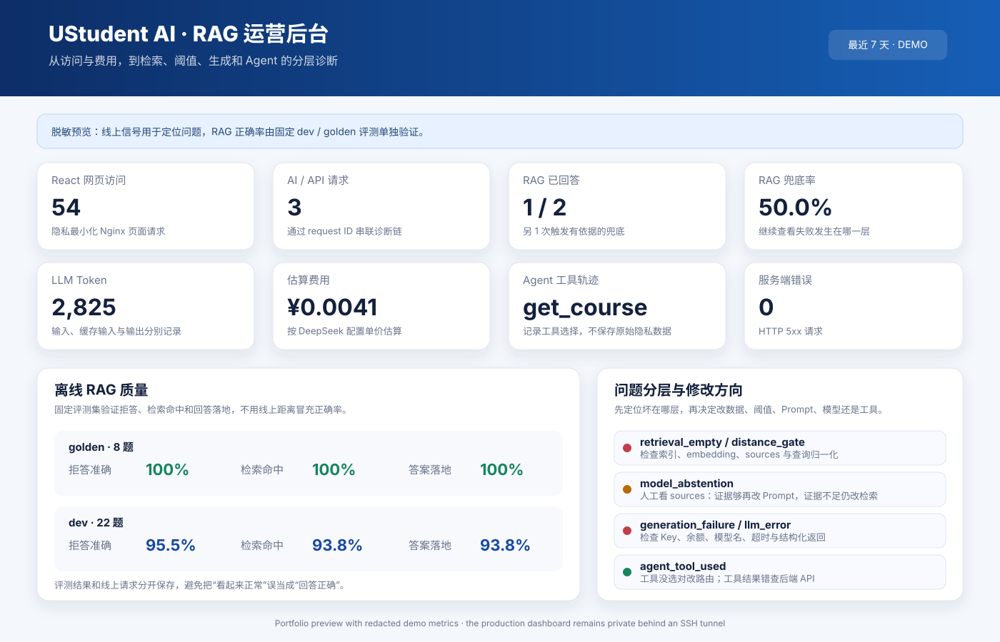

# UStudent AI — RAG、Agent 与 LLMOps 选课助手

[English](README.md) · **简体中文**

[](https://github.com/Fakercoke/ustudent-ai/actions/workflows/tests.yml)

> 接入课程提供的模拟大学教务系统：能够根据学生手册进行有来源的问答、查询种子课程数据、保持多轮上下文，并调用 Demo 选课工具。

**在线系统：** [http://49.235.155.82/](http://49.235.155.82/)

**API 文档：** [http://49.235.155.82:8000/docs](http://49.235.155.82:8000/docs)

**GitHub：** [github.com/Fakercoke/ustudent-ai](https://github.com/Fakercoke/ustudent-ai)

> React 前端、种子 PostgreSQL 数据和 Spring Boot 选课后端由课程提供，属于模拟系统而非真实大学生产环境；本仓库包含我独立实现的 AI 服务、评测、安全机制、实验分析、自动化测试、运营后台、系统集成和部署配置。

## 核心数据

| 工程指标 | 实测结果 |
|---|---:|
| 自动化测试 | **本地收集并通过 161 个**；每次 push 自动运行 CI |
| 课程验收/回归集 | **8/8（100%）** |
| 开发集拒答准确率 | **21/22（95.5%）** |
| 开发集检索/答案落地 | **15/16（93.8%）** |
| 中文检索距离 | **0.684 → 0.270** |
| 拼写错误 `gradute` | **0.639 → 0.445** |
| 中英文回归用例 | **9/9 正确召回** |

## 30 秒项目亮点

**UStudent AI — 智能选课 RAG 与 Agent 系统｜个人项目**

- 基于 FastAPI、ChromaDB 和 LangGraph 独立实现选课场景 AI 服务，支持学生手册 RAG 问答、种子课程查询、进程内多轮记忆及 Demo 选课工具调用。
- 通过三组切块对照和词向量实验定位 embedding 对中文、短问题及拼写错误的脆弱性，设计查询归一化与双层拒答机制，使中文检索距离由 **0.684 降至 0.270**，课程验收/回归集达到 **8/8**。
- 搭建确定性 RAG 评测、PII 脱敏、Prompt Injection 防护及密码保护的运营后台，完成 **161 个自动化测试**；将 AI 服务接入课程提供的 React/Spring Boot/PostgreSQL 系统，并通过 Docker Compose 部署至腾讯云。

**快速查看：** [系统架构](#系统架构) · [RAG 排障实验](#最有价值的一次排障) · [LLMOps 预览](#运营与-rag-质量后台) · [项目边界](#项目边界) · [已知局限](#已知局限)

## 系统架构

```text
学生浏览器
    │
    ▼
React 前端（课程提供的模拟系统）
    ├── /api/* ──► Spring Boot 后端 ──► 种子 PostgreSQL
    │                   ▲
    └── /ai/*  ──► UStudent AI 服务
                      ├── RAG ──► Chroma + 学生手册
                      ├── Agent ─► 课程查询 / Demo 选课 / 手册问答
                      └── LLM ───► DeepSeek
```

四个服务通过 Docker Compose 部署在腾讯云，并配置健康检查、数据库持久化、反向代理、内存限制和容器自动重启。

## 项目简介

UStudent AI 是一个接入模拟大学选课系统的智能服务。学生可以使用中文或英文提问，系统会判断应该：

1. 从学生手册中检索政策并生成有依据的回答；
2. 调用课程提供的模拟业务后端查询种子课程信息；
3. 调用 Demo 选课工具修改模拟数据；
4. 当资料不足时明确拒答，而不是让大模型自由编造。

这是我的个人 AI 工程项目。课程提供 React 前端和 Spring Boot 选课后端作为集成环境；本仓库中的 FastAPI AI 服务、RAG、Agent、评测、安全机制、实验分析、测试和部署工作由我完成。

## 核心成果

- 实现基于 Chroma 的 RAG 管线，返回答案、来源章节和检索距离。
- 实现 LangGraph ReAct Agent，能够在 `get_course`、`enrol_course` 和 `handbook_qa` 三个工具之间做决策。
- 支持线程级多轮记忆，可以理解“它有多少学分”“帮我选它”等上下文问题。
- 针对中文、口语、短问题和拼写错误加入受约束的查询归一化。
- 建立 dev 与课程验收/回归两套评测集：dev 拒答 **21/22**、检索与答案落地 **15/16**，课程验收/回归集 **8/8**。后者参与过早期设计分析，不宣称为严格盲测。
- 完成 PII 脱敏和检索材料 Prompt Injection 拦截。
- 全仓自动化测试 **161 passed**。
- 实现轻量运营后台，统一查看请求量、RAG 距离与失败分层、Agent 工具轨迹、模型 Token/估算费用、离线评测结果，并可打印或导出周报。
- 使用 Docker Compose 将前端、后端、PostgreSQL 和自定义 AI 服务部署至腾讯云，并配置持久化、健康检查、反向代理和自动重启。

## 最有价值的一次排障

项目最初对自然、口语化测试问法不稳定：`graduate` 能检索到正确章节，却因为距离较高被阈值拒绝；拼错成 `gradute` 后则直接召回无关章节；中文问题“毕业需要多少学分”也会命中错误内容。

我没有直接反复调整阈值，而是分层验证：

1. 对比三种切块方法，发现拼写错误在所有索引中都失败，因此排除切块问题；
2. 直接比较词向量，发现 `graduate` 与 `gradute` 的相似度只有 **0.549**，与无关词 `advising` 的 **0.491** 已非常接近；
3. 拼错后前十名结果挤在 **0.054** 的距离范围内，第一、第二名只差 **0.013**，说明排名接近噪声；
4. 增加检索前查询归一化，并坚持“改写只用于检索、原问题用于回答”；
5. 中文检索距离从 **0.684 降至 0.270**，`gradute` 从 **0.639 降至 0.445**，9 组中英文回归用例全部正确召回。

这个实验让我确认：问题根因是当前 embedding 模型对短文本拼写错误较脆弱，而不是切块方式或阈值本身。

## 为什么阈值不是越严格越好

原始阈值 `0.40` 在标准测试集上表现很好，但自然语言测试表达 `how can i graduate` 的距离为 `0.445`，虽然已经召回正确章节，仍然被误判成“手册里没有”。与此同时，一道手册无法回答的问题距离为 `0.520`。

有效问题和无效问题的距离区间发生重叠，因此不存在一个完美的单一阈值。我最终使用双层兜底：

- 第一层使用较宽松的 `0.75`，只过滤明显无关的检索结果；
- 第二层让生成阶段根据证据是否充分决定回答或拒答。

这不是简单“放宽阈值”，而是把检索相关性与答案充分性拆成两个不同判断。

## 技术栈

```text
Python · FastAPI · Pydantic · ChromaDB · Sentence Transformers
LangGraph · OpenAI-compatible API · DeepSeek
Pytest · Docker · Docker Compose · PostgreSQL · Nginx · Tencent Cloud
```

## 运营与 RAG 质量后台



> **作品集 UI mockup：** 这张 SVG 按真实后台布局制作，并使用少量脱敏 Demo 数据，不冒充实时页面截图。实际后台仍受密码保护，并且只能通过 SSH 隧道访问，因此 GitHub 不会公开后台账号、密码或真实请求数据。

`/ops` 用同一个 request ID 串起一次请求的整条诊断链：

```text
HTTP 请求 → 检索距离与来源 → 回答或兜底
          → Agent 工具 → LLM Token/错误 → 问题分层 → SQLite
```

后台把“线上风险信号”和“真实质量”分开：线上可以看到空召回、距离门槛拒答、模型二次拒答、生成失败、安全拦截、响应时间和 Token 使用，但不能仅凭这些数据宣布回答正确；真正的正确率单独读取固定 dev 与课程验收/回归集的最新结果。问题预览只进行有限的正则脱敏并限制为 200 字，客户端地址只保存加盐哈希，未配置 `OPS_ADMIN_PASSWORD` 和私有盐时后台默认关闭。后台支持打印为 PDF 和下载 Markdown 周报。

React 主站通过最外层 Nginx 的隐私最小化 JSON 日志统计页面入口与刷新，不记录 IP、查询参数、来源页或浏览器信息；纯前端 SPA 内部跳转不会产生服务器请求，因此不会被另算一次 PV。AI/API 请求始终单独统计，不会冒充网页访问量。

具体开启方式、指标含义与排障顺序见 [`docs/operations-dashboard.md`](docs/operations-dashboard.md)。

## 面试版项目描述

> 独立实现并部署了接入模拟选课后端的 RAG + Agent 服务：使用 Chroma 构建学生手册知识库，通过 LangGraph Agent 编排政策问答、课程查询和 Demo 选课工具；针对中文、口语及拼写错误设计查询归一化与双层拒答机制，并通过受控实验定位 embedding 对短文本错拼的脆弱性。建立 dev 与课程验收/回归评测及轻量 LLMOps 诊断后台，完成 PII 脱敏和 Prompt Injection 防护，最终实现 161 个自动化测试通过、课程回归集 8/8，并以 Docker Compose 集成课程提供的 React/Spring Boot/PostgreSQL 模拟系统部署至腾讯云。

## 项目边界

为了确保描述真实、可经受面试追问：

- 我独立完成的是 AI 服务及其工程化工作；
- React 前端和 Spring Boot 业务后端由课程提供；
- 我完成了 AI 与既有系统的接口集成、容器编排和腾讯云部署；
- `enrol_course` 只修改模拟数据，不代表具备真实大学系统的生产权限；
- 我不会把老师提供的前后端描述成自己从零开发。

## 已知局限

- 8 题课程验收集参与过项目早期的设计分析，因此 **8/8 是回归/验收结果，不是从未见过的严格盲测准确率**。
- Demo 写入接口没有生产级登录鉴权、授权、操作确认和幂等保护；`enrol_course` 只用于模拟演示。
- LangGraph `MemorySaver` 是进程内存储，AI 服务重启后会丢失对话记忆，多副本之间也不会共享。
- 稠密检索仍难以区分 `CS101` 和 `CS201` 等精确标识符，后续应加入 BM25 混合检索。
- 查询改写会增加延迟，并存在语义偏移这一黑盒风险。
- 公开 Demo 当前使用 HTTP IP；域名、备案和 HTTPS 仍是后续部署项。
- 网页 PV 只统计 Nginx 收到的页面入口与刷新，纯前端 SPA 内部跳转不会被另算一次访问。

## 下一步

- 引入 BM25 + dense hybrid retrieval，改善 `CS101`/`CS201` 等精确标识符检索；
- 增加 reranker，并用更大评测集验证收益；
- 为查询改写增加语义漂移检测和延迟监控；
- 配置域名、备案与 HTTPS；
- 增加线上 SLI/SLO、结构化日志和质量漂移监控。

如果你希望了解这个项目背后的真实实验和排障过程，可以从 [`docs/portfolio/`](docs/portfolio/) 开始阅读。
